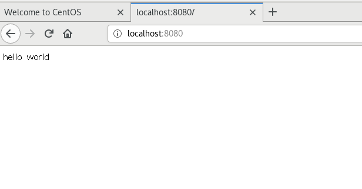

## 服务计算

使用框架 martini 

` go get github.com/codegangsta/martini `

 一个微型框架，只带有简单的核心，路由功能和依赖注入容器inject。 


`go run main.go`

```
[martini] listening on :8080 (development)
[martini] Started GET / for [::1]:45730
[martini] Completed 200 OK in 186.844µs
[martini] Started GET /favicon.ico for [::1]:45732
[martini] Completed 404 Not Found in 111.771µs
[martini] Started GET /favicon.ico for [::1]:45730
[martini] Completed 404 Not Found in 20.537µs
[martini] Started GET / for [::1]:45764
[martini] Completed 200 OK in 92.556µs
[martini] Started GET / for [::1]:45786
[martini] Completed 200 OK in 82.788µs
```


`curl -v http://localhost:8080 `

```
[chen@centosbase cloudgo]$ curl -v http://localhost:8080
* About to connect() to localhost port 8080 (#0)
*   Trying ::1...
* Connected to localhost (::1) port 8080 (#0)
> GET / HTTP/1.1
> User-Agent: curl/7.29.0
> Host: localhost:8080
> Accept: */*
> 
< HTTP/1.1 200 OK
< Date: Mon, 11 Nov 2019 13:33:39 GMT
< Content-Length: 11
< Content-Type: text/plain; charset=utf-8
< 
* Connection #0 to host localhost left intact
[chen@centosbase cloudgo]$ 
```



`ab -n 1000 -c 100 http://localhost:8080/`

执行请求数量1000个 并发请求个数100个 主机localhost 监听端口 8080

参数

```\
Document Path: 请求的资源
Document Length: 文档返回的长度，此处是28bytes
Concurrency Level: 并发个数
Time taken for tests: 总请求时间
Complete requests: 总成功请求数
Failed requests: 失败的请求数
Write errors: 错误数
Total transferred: 传输总字节数
HTML transferred: HTML传输字节数
Requests per second: 平均每秒的请求数
Time per request: 平均每个请求消耗的时间
Time per request: 平均请求消耗时间除以并发数
Transfer rate: 传输速率
Connection Times：说明了连接、处理、等待和总时间的最小值、最大值、中间值和均值。
Percentage of the requests served within a certain time：说明了请求完成的百分比和所用时间。
```

```
[chen@centosbase cloudgo]$ ab -n 1000 -c 100 http://localhost:8080/
This is ApacheBench, Version 2.3 <$Revision: 1430300 $>
Copyright 1996 Adam Twiss, Zeus Technology Ltd, http://www.zeustech.net/
Licensed to The Apache Software Foundation, http://www.apache.org/

Benchmarking localhost (be patient)
Completed 100 requests
Completed 200 requests
Completed 300 requests
Completed 400 requests
Completed 500 requests
Completed 600 requests
Completed 700 requests
Completed 800 requests
Completed 900 requests
Completed 1000 requests
Finished 1000 requests


Server Software:        
Server Hostname:        localhost
Server Port:            8080

Document Path:          /
Document Length:        11 bytes

Concurrency Level:      100
Time taken for tests:   0.699 seconds
Complete requests:      1000
Failed requests:        0
Write errors:           0
Total transferred:      128000 bytes
HTML transferred:       11000 bytes
Requests per second:    1431.00 [#/sec] (mean)
Time per request:       69.881 [ms] (mean)
Time per request:       0.699 [ms] (mean, across all concurrent requests)
Transfer rate:          178.87 [Kbytes/sec] received

Connection Times (ms)
              min  mean[+/-sd] median   max
Connect:        0    2   1.1      2       6
Processing:    20   61  19.9     58     143
Waiting:       20   59  20.2     56     142
Total:         22   64  19.3     60     143

Percentage of the requests served within a certain time (ms)
  50%     60
  66%     68
  75%     71
  80%     77
  90%     96
  95%    100
  98%    100
  99%    100
 100%    143 (longest request)
[chen@centosbase cloudgo]$ 
```

